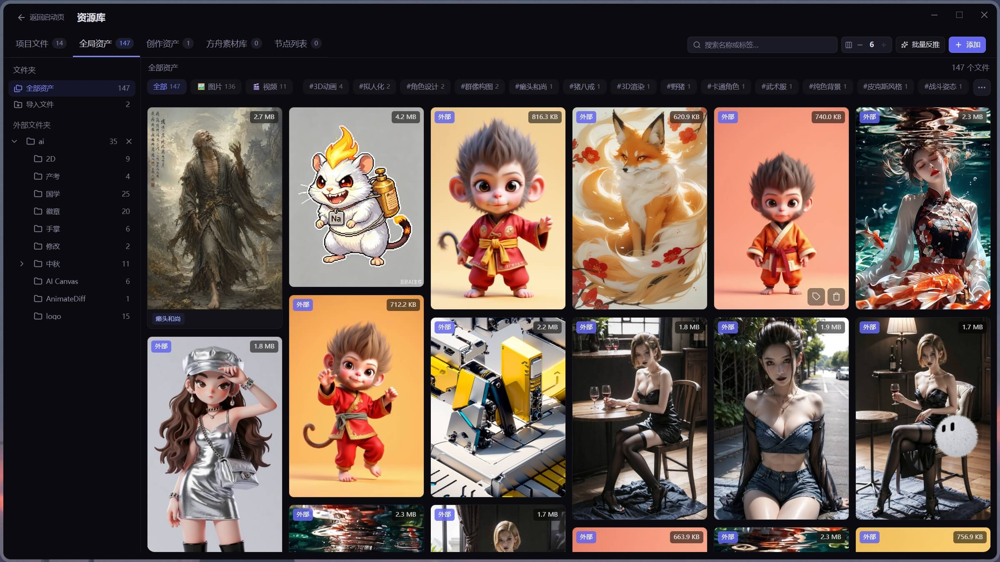
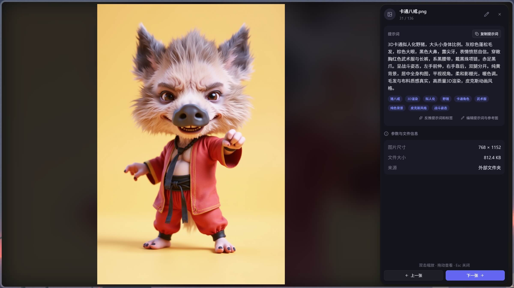
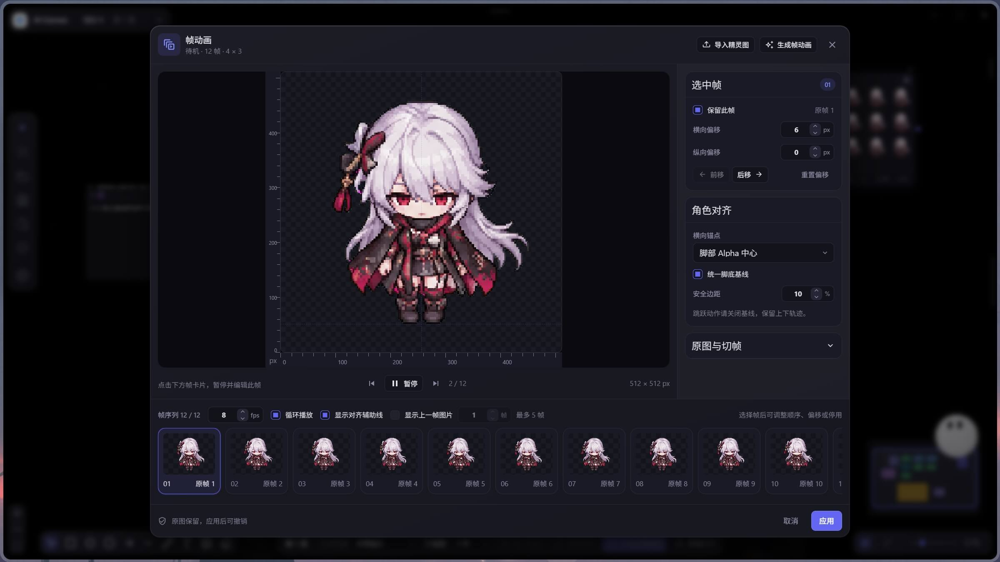

# AI Canvas Tauri — AI 画布、AI短剧与AI资产管理

> ⭐ **开源计划：** 当本项目的 GitHub Stars 达到 **10,000（10k）** 时，项目自有代码将转用 **[MIT License（MIT 许可证）](https://opensource.org/license/mit)**，允许自由使用、修改、分发和商用，须保留版权声明和许可文本。在此之前，仍以 [LICENSE](LICENSE) 中的当前许可条款为准。

**简体中文** · [English](README.en.md) · [日本語](README.ja.md) · [한국어](README.ko.md)

<p align="center">
  
</p>

> 面向 **AI短剧创作、AI资产管理、图像/视频生成与分镜制作** 的本地优先 AI 多模态画布与可视化工作流桌面应用，集成 **ComfyUI、对话 AI Agent 与 MCP**，基于 **Tauri 2 + React 19 + React Flow 12** 构建。

AI Canvas Tauri 将文本、图像、视频、音频、逐帧动画、Markdown、分镜、360° 全景和手绘笔记组织成可连接的画布节点。你可以在同一个项目中编排生成链路、统一管理角色库、人物/场景/道具与本地素材、执行 ComfyUI 工作流、安装 JavaScript 或可信 Python 用户插件，也可以通过对话助手查询或修改画布、生成媒体、派出只读子智能体、读取授权文件并沉淀项目记忆。项目还能拆成剧集与分集，一部 AI短剧的每一集各占一张画布，角色库与素材整部剧共用。


**在线体验：** <https://tenney95.github.io/AI-Canvas-tauri/>（首屏可直接试用，内置演示画布）

**下载：** <https://github.com/tenney95/AI-Canvas-tauri/releases>（获取桌面安装包）

[在线体验](https://tenney95.github.io/AI-Canvas-tauri/) · [下载](https://github.com/tenney95/AI-Canvas-tauri/releases) · [核心能力](#核心能力) · [快速开始](#快速开始) · [项目文档](#项目文档) · [License](#license)

> 在线版适合体验画布与界面。用户插件、文件系统、凭据存储、独立窗口、3D 导演台、本地模型等能力依赖 Tauri 桌面环境；完整体验请按下方步骤启动桌面应用。

## 界面预览


### 资源库

统一浏览项目文件与全局资产，按类型、文件夹和标签筛选素材。



### 资产详情与提示词

全屏预览图片，查看与编辑提示词、参考图和标签，并查看图片尺寸、文件大小与来源。



### 帧动画编辑

逐帧预览与编辑动画，调整帧顺序、偏移、播放帧率和角色对齐。



## 核心能力

| 能力 | 说明 |
| --- | --- |
| 多模态节点画布 | 文本、图像、视频、音频、逐帧动画、Markdown、分镜、全景、3D 导演台、源文件和画布笔记统一连接。支持小地图分类统计、远景轻节点与渐进显示；原图与画布数据保留。 |
| 帧动画编辑与导出 | 导入或生成 Sprite Sheet，校正宫格、排序或停用帧、调整偏移、帧率与循环。桌面端通过 Rust 处理并导出 GIF、PNG 序列帧或 PNG 图集 + JSON，预览与导出共用帧编排。 |
| AI 与工作流 | 云端模型、自定义模型执行协议与试跑、CCC 统一入口管理多分组 Key、按模型自动匹配、ComfyUI 多服务器、RunningHub 云工作流/AI 应用、通用工作流 API（含 AutoDL H3 模板）、Dreamina 和本地 ONNX 推理。内置 DLSS5 图片/视频材质增强模板，目标 ComfyUI 需安装对应节点；上传、进度和任务恢复按平台处理。 |
| 用户插件 | 从本地、市场或 GitHub Release 安装 JavaScript / 可信 Python 插件，扩展工具、节点与宿主管理的界面。JavaScript 使用 QuickJS 沙箱；Python 拥有当前用户权限。入口摘要与完整 revision 摘要共同校验，停用或换版本后旧调用不能继续写回。 |
| 剧本与分镜制作 | 原著章节浏览、分集创作工作台、剧本快照、镜头改稿与补图，准备配音/视频/导演节点，并把对白字幕与已就绪配音推送时间轴。角色动作素材可通过 @ 引用。 |
| 内置视频剪辑 | 独立编辑器支持多轨编排、裁剪与分割、画面变换、转场、文字、贴纸和音量调整，可无损直通或合成导出。MCP 另有创建/修改工程、后台导出、媒体探测与抽帧入口。 |
| 对话 Agent | 多会话、流式响应、Plan/B/C 三种执行模式、工具调用、审批卡片和项目记忆。续聊保留完整近期轮次与脱敏工具结果，长执行可压缩上下文；内嵌与独立窗口同步草稿、模型目录和任务视图。支持导入 Agent Package。 |
| AI 应用节点 | 仅由内置 Agent / MCP 创建，用户可打开使用、执行只读动作并显式保存状态或结果。首版支持隔离的 HTML/CSS 界面与 Worker JavaScript，仅访问绑定画布素材，不开放任意文件或网络。 |
| 只读子智能体 | 用户自定义领域角色；主任务按需派出并行只读子智能体，产出脱敏后回传。 |
| 角色与创作资产 | 项目/全局角色卡、多参考图、声音与动作素材，以及人物、场景、道具的提取、简介和绑图。 |
| MCP 外部控制 | 默认关闭，支持本机 stdio 和需额外配置确认的 Streamable HTTP；默认按需发现工具。可批量导入媒体、分块上传图片、粘贴系统内容、截图入画布和操作剪辑工程。MCP 按自主模式执行，用户选择仍需本人回答。 |
| 本地存储与设置保护 | 项目媒体落盘，结构化数据保存在 IndexedDB，API Key 由 Rust 凭据存储隔离。设置按修改字段保存并检测冲突；失败保留草稿，提供重试或重新加载，退出前等待保存。 |
| 剧集与分集 | 每集独立画布，整部剧共享角色库、项目记忆与素材目录；助手可根据剧本批量创建分集。 |
| 资产库与预览 | Tab 开关左侧资产库，浏览项目文件、全局资产、创作资产和节点列表。资源改名同步对应画布节点名称；节点卡片支持定位与拖线，图片全屏按编号切换，视频悬浮播放，输出历史可固定。支持可恢复删除与桌面 .aicanvas 项目包。 |
| 资源编辑与反推 | 编辑图片提示词、参考图与标签，支持单图和批量反推，成功后自动保存提示词与标签。文本与 Markdown 共用大屏编辑器，资源文件手动保存并检查外部修改冲突。 |
| 新手引导与帮助 | 首启引导、按场景组织的帮助中心与可离线打开的操作说明书；说明 @ 引用、ComfyUI 输入、快捷键及自定义接口配置。 |
| 三种导演台运行时 | 轻量导演台、Blender 高级编辑与 AI 镜头预演。AI 预演根据显式引用的分镜或图片生成受限 JSON 场景，支持播放、截图与 MP4 输出；MCP 可读合同、读写场景。Blender 支持 Windows x86_64、macOS Intel/Apple Silicon 和 4.5、5.0、5.1、5.2 稳定系列，保存返回校验摄影机 PNG 与 .blend 工程。 |
| 外观与悬浮入口 | 完整外观预设统一页面、画布、节点、连线和手柄，支持自定义保存及 `.aicanvas-theme` 导入导出。顶部项目栏和右上操作记录以提示线作为悬浮入口，展开采用轻量动效并支持减少动态效果。 |
| 视频批次与本地用量 | 视频批次预检物料、串行提交，重开后不自动重投未完成任务。火山方舟图片/视频节点的桌面本地账本支持价格快照、用量查询与 Excel 导出；估算或核算金额不等于官方账单。 |

文档主体按 0.10.1 源码核对（2026-10-08），0.10.2 增量补充 CCC 统一入口与分组 Key 自动匹配（2026-10-09）；实际安装包功能以对应版本为准，代码与自动化检查不代表真实模型、桌面多窗口和各平台均已验收。操作步骤见[操作说明书](site/manual.html)，模块边界与验收入口见[文档导航](doc/文档导航.md)。

## 技术栈

| 技术 | 用途 |
| --- | --- |
| [Tauri 2](https://tauri.app/) + Rust | 桌面壳、窗口、文件、更新、本地模型与系统能力 |
| [React 19](https://react.dev/) + TypeScript 6 | UI、领域类型和严格类型检查 |
| [React Flow 12](https://reactflow.dev/) | 节点画布、连线与视图控制 |
| [Zustand 5](https://zustand.docs.pmnd.rs/) | Slice 化全局状态管理 |
| [Tailwind CSS 3](https://tailwindcss.com/) | 组件样式与 `canvas-*` 设计 token |
| [Vitest](https://vitest.dev/) | 自动化测试 |
| IndexedDB | 本地结构化数据持久化 |

## 快速开始

### 环境要求

- Node.js：满足 Vite 8 的运行要求，建议使用当前 LTS
- npm
- Rust stable toolchain
- Blender 高级编辑（可选）：Windows x86_64 或 macOS Intel/Apple Silicon，4.5 / 5.0 / 5.1 / 5.2 稳定系列；轻量导演台不依赖 Blender。
- 对应平台的 [Tauri 系统依赖](https://v2.tauri.app/start/prerequisites/)

Windows 构建还需要 Visual Studio Build Tools 2022，并安装“使用 C++ 的桌面开发”工作负载。

### 安装依赖

```bash
npm install
```

### 启动开发环境

```bash
# 仅启动 Web 前端，默认访问 http://localhost:1420
npm run dev

# 启动完整 Tauri 桌面应用
npm run tauri dev
```

Web 模式适合界面开发；用户插件、原生对话框、本地文件工具、独立窗口、本地模型和 3D 导演台等能力需要 Tauri 桌面环境。

### 检查与构建

```bash
# TypeScript 类型检查
npm run typecheck

# ESLint 检查
npm run lint

# 单元测试（Vitest）
npm run test

# lint + 类型检查 + 测试
npm run check

# 前端生产构建
npm run build

# 桌面应用构建
npm run tauri build
```

版本以 `package.json` 为源。`npm run sync-version` 当前只同步 `README.md` 版本徽章和 `src-tauri/Cargo.toml`；Tauri 配置、其他语言 README、站点与说明书需分别核对，见[打包与发版流程](doc/打包与发版流程.md)。

## 项目文档

- [操作说明书](site/manual.html)
- [模块文档导航](doc/文档导航.md)
- [开发指南](doc/开发指南.md)：环境、命令、目录、开发约定、调试和常见问题
- [架构说明](doc/架构说明.md)：核心模块、数据流、安全边界和性能设计
- [插件开发规范](doc/插件开发规范.md)：Manifest、JavaScript/Python 运行时、自定义节点、权限、安全边界、安装更新与发布规范
- [开源插件开发示例：逐帧拉片](https://github.com/luckcatlin2000/ai-canvas-video-frame-review-plugin)：参考自定义界面、授权视频抽帧、模型分析、线稿转换与分镜节点输出；插件需用户单独安装。
- [ComfyUI 工作流集成说明](doc/ComfyUI工作流集成说明.md)：导入、IO 节点识别、内容与参数注入、结果取回
- [对话式画布助手功能方案](doc/对话式画布助手-功能方案.md)
- [对话助手 Agent 能力实施方案](doc/对话助手-Agent能力实施方案.md)
- [打包与发版流程](doc/打包与发版流程.md)

长期工程边界以仓库内的 [AGENTS.md](AGENTS.md) 为准，架构决策记录位于 [`doc/adr/`](doc/adr/)。

## License

本项目采用 **AI Canvas Tauri Source-Available License**，完整条款见 [LICENSE](LICENSE)。

允许学习、研究、内部使用、修改和集成使用。禁止未经授权的套壳销售、白标分发、源码转售、商业再分发及将本项目作为同类产品进行商业化。

本项目并非 OSI 定义下的开源项目。如需商业授权，请联系版权方。

### 第三方素材

画布笔记的工具条与属性面板视觉设计参考自 [Excalidraw](https://github.com/excalidraw/excalidraw)，其许可证见 [doc/licenses/excalidraw-MIT.txt](doc/licenses/excalidraw-MIT.txt)。

## Contact

开发沟通 QQ 群：873354155

## 代码贡献

<p>
  <a href="https://github.com/zhurui0523" title="zhurui0523"></a>
  <a href="https://github.com/stars-one" title="stars-one"></a>
  <a href="https://github.com/luckcatlin2000" title="luckcatlin2000"></a>
  <a href="https://github.com/orlova851986-debug" title="orlova851986-debug"></a>
  <a href="https://github.com/Lazzz-y" title="Lazzz-y"></a>
  <a href="https://github.com/xiaozangao" title="xiaozangao"></a>
</p>
